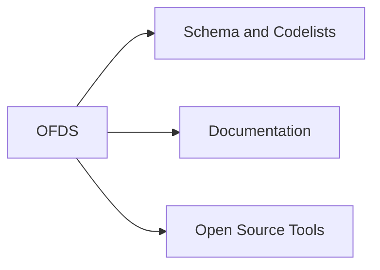
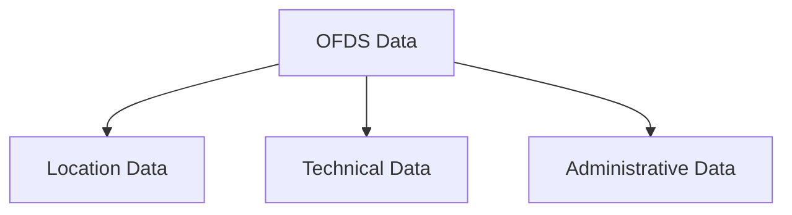
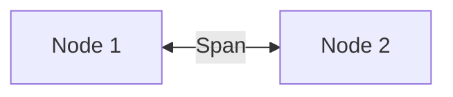
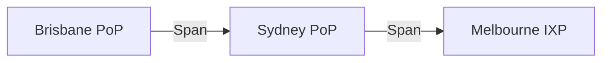

# Open Fibre Data Standard (OFDS) Guide

## Introduction

The Open Fibre Data Standard (OFDS) is a common language for describing terrestrial fibre optic networks. It provides a standardised approach for publishing, exchanging, analysing and visualising fibre network information.

## OFDS Components

## OFDS Data Categories

## Key Terminology

### Node
A point within a network such as a PoP, IXP, tower or cable landing station.

### Span
A physical fibre connection between two nodes.

### Endpoint
The start and end nodes connected by a span.

### Network
A collection of interconnected nodes and spans.

## Node and Span Relationship

## Example Network

## OFDS and GIS

| OFDS Concept | GIS Equivalent |
|-------------|---------------|
| Node | Point Feature |
| Span | Line Feature |
| Network | Layer or Dataset |
| Attribute | Table Column |
| Geometry | Shape |

## Why Mermaid

Mermaid is generally the better choice for GitHub documentation because it renders natively in GitHub, remains editable as text, works well with version control, and avoids maintaining separate image files.
