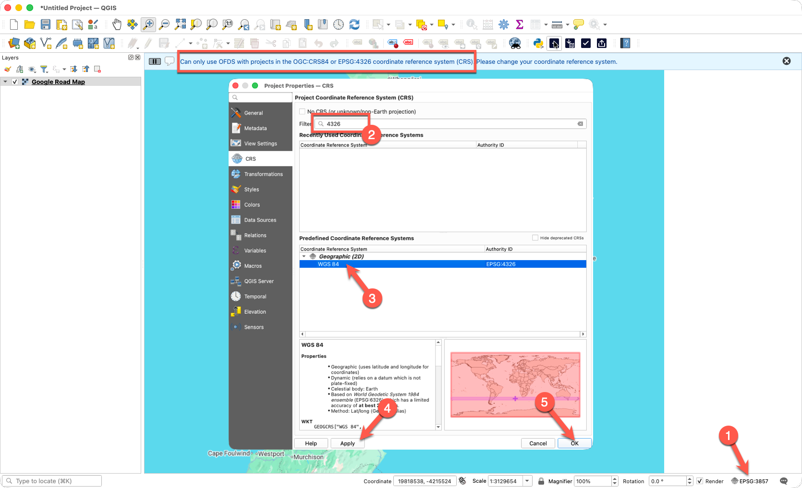

# Changing the Project Coordinate Reference System (CRS) for OFDS in QGIS

## Overview

The OFDS QGIS plugin requires the project Coordinate Reference System (CRS) to be set to either:

- OGC:CRS84
- EPSG:4326 (WGS 84)

If the project is using another CRS, such as **EPSG:3857 (Web Mercator)**, the plugin will display the following warning:

> Can only use OFDS with projects in the OGC:CRS84 or EPSG:4326 coordinate reference system (CRS). Please change your coordinate reference system.

## Example Error

The example below shows the warning generated by the OFDS plugin when the project CRS is not configured correctly.



## Steps to Change the Project CRS

### Step 1 - Open Project Properties

From the QGIS menu:

**Project → Properties**

The **Project Properties** window will open.

### Step 2 - Search for EPSG:4326

Select the **CRS** tab.

In the **Filter** box, enter:

```text
4326
```

QGIS will display matching coordinate reference systems.

### Step 3 - Select WGS 84 (EPSG:4326)

From the results list, select:

```text
WGS 84 (EPSG:4326)
```

This is the coordinate reference system required by the OFDS plugin.

### Step 4 - Apply the Change

Click:

```text
Apply
```

This updates the project CRS.

### Step 5 - Save the Setting

Click:

```text
OK
```

to close the Project Properties window.

## Verify the Change

After applying the change, check the lower-right corner of the QGIS window.

You should see:

```text
EPSG:4326
```

instead of:

```text
EPSG:3857
```

## What Happens to the Google Road Map Layer?

The Google Road Map XYZ layer uses:

```text
EPSG:3857
```

This is normal and does not need to be changed.

QGIS automatically reprojects the map tiles to match the project's coordinate reference system. The background map will continue to display normally after changing the project CRS.

## Recommended OFDS Workflow

When creating a new OFDS project:

1. Create a new QGIS project.
2. Change the Project CRS to **EPSG:4326**.
3. Save the project.
4. Create a new OFDS GeoJSON file.
5. Add background map layers such as Google Road Map or OpenStreetMap.
6. Begin digitising infrastructure features.

Following this workflow helps avoid CRS-related errors and ensures compatibility with the OFDS plugin.

## Troubleshooting

### Warning Still Appears

Verify that you changed the **Project CRS** and not the CRS of an individual layer.

The OFDS plugin checks the project CRS only.

### OFDS Plugin Does Not Respond

If the plugin remains busy for several minutes after selecting **Create New OFDS GeoJSON**:

1. Confirm the project CRS is set to EPSG:4326.
2. Start a new blank QGIS project.
3. Test the OFDS plugin before adding any background layers.
4. Check the QGIS Log Messages Panel for plugin errors.

### Project Shows EPSG:3857 After Restarting

Save the project after changing the CRS to ensure the setting is retained when QGIS is reopened.

## References

- [QGIS Coordinate Reference System Documentation](https://docs.qgis.org/latest/en/docs/user_manual/working_with_projections/working_with_projections.html)
