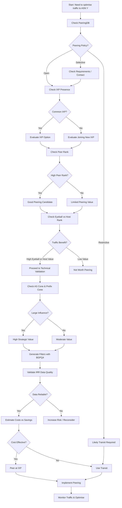

## Peering Decision Flow (Conceptual Overview)

```mermaid
flowchart TD

A[Start: Need to optimise traffic to ASN Y] --> B[Check PeeringDB]

B --> C{Peering Policy?}

C -->|Open| D[Check IXP Presence]
C -->|Selective| E[Check Requirements / Contact]
C -->|Restrictive| F[Likely Transit Required]

E --> D

D --> G{Common IXP?}

G -->|Yes| H[Evaluate IXP Option]
G -->|No| I[Evaluate Joining New IXP]

H --> J[Check Peer Rank]
I --> J

J --> K{High Peer Rank?}

K -->|Yes| L[Good Peering Candidate]
K -->|No| M[Limited Peering Value]

L --> N[Check Eyeball vs Host Rank]
M --> N

N --> O{Traffic Benefit?}

O -->|High Eyeball or Host Value| P[Proceed to Technical Validation]
O -->|Low Value| Q[Not Worth Peering]

P --> R[Check AS Cone & Prefix Cone]

R --> S{Large Influence?}

S -->|Yes| T[High Strategic Value]
S -->|No| U[Moderate Value]

T --> V[Generate Filters with BGPQ4]
U --> V

V --> W[Validate IRR Data Quality]

W --> X{Data Reliable?}

X -->|Yes| Y[Estimate Costs vs Savings]
X -->|No| Z[Increase Risk / Reconsider]

Y --> AA{Cost Effective?}

AA -->|Yes| BB[Peer at IXP]
AA -->|No| CC[Use Transit]

F --> CC

BB --> DD[Implement Peering]
CC --> DD

DD --> EE[Monitor Traffic & Optimise]

```
